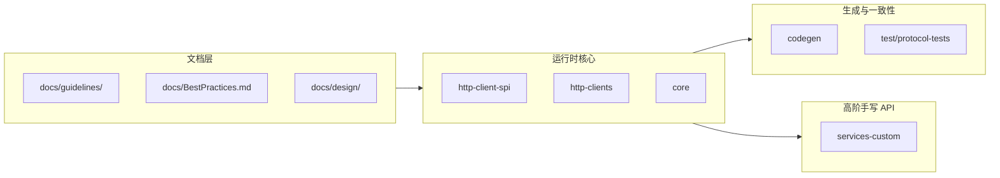

# 学习地图与学习路线

> 目标不是“读完仓库”，而是先建立 4 个稳定心智模型：`Builder / 不可变配置 / HTTP SPI / 异步管线`。这四块一旦立住，再看 `core`、`codegen`、`services-custom` 才不容易迷路。

---

## 一、总览地图（模块 → 你真正要学什么）

| 区域 | 先看什么 | 你真正要得到什么 |
|------|----------|------------------|
| `docs/BestPractices.md` | Client 生命周期、流关闭、超时 | 先知道“正确使用姿势”，别一上来只看实现 |
| `docs/guidelines/ClientConfiguration.md` | Configuration Fields 一节 | 为什么 SDK 到处是 Builder、不可变对象、防御性拷贝 |
| `http-client-spi` | `SdkHttpClient` | 核心语义和“发 HTTP”是怎么切开的 |
| `core` | `SdkDefaultClientBuilder`、配置类、测试 | 默认值、override、sync/async 分叉是怎么落地的 |
| `docs/guidelines/async-programming-guidelines.md` | CompletableFuture Guidelines | 异步最容易踩的线程、异常、阻塞问题 |
| `codegen` + `test/protocol-tests` | 第二轮再看 | 为何服务模块很多，但 API 还能保持统一 |
| `services-custom` | 第二轮再看 | 手写高阶库如何站在生成客户端之上 |

---

## 二、最短入门顺序（推荐 2～3 次，每次 45～90 分钟）

这条顺序故意**不按仓库目录顺序**走，而是按“先有反馈，再回真代码找锚点”走。

| 步骤 | 先读什么 | 先跑什么 demo | 再看哪段真代码 | 这一步只回答一个问题 |
|------|----------|----------------|----------------|----------------------|
| 1 | `learning/NOTES.md` 的「心智模型」「设计词汇」+ `docs/BestPractices.md` 前几节 + `docs/guidelines/ClientConfiguration.md` 的 Configuration Fields | `BuilderAndImmutableConfigDemo` | `core/sdk-core/src/main/java/software/amazon/awssdk/core/client/config/ClientOverrideConfiguration.java` 和对应测试 `core/sdk-core/src/test/java/software/amazon/awssdk/core/client/config/ClientOverrideConfigurationTest.java` | 为什么 SDK 大量使用 Builder、不可变对象、集合拷贝？ |
| 2 | 回看 `learning/NOTES.md` 第 1 节，然后直接读 `http-client-spi/src/main/java/software/amazon/awssdk/http/SdkHttpClient.java` | `HttpClientSpiDemo` | `core/sdk-core/src/main/java/software/amazon/awssdk/core/client/builder/SdkDefaultClientBuilder.java` 里 `syncClientConfiguration()` / `asyncClientConfiguration()` 的合并顺序 | 哪层负责“语义与策略”，哪层只负责“发 HTTP”？ |
| 3 | `docs/guidelines/async-programming-guidelines.md` 的 CompletableFuture Guidelines | `AsyncPipelineMiniDemo` | 搜索 `CompletableFutureUtils` 的使用点，优先看 `codegen/src/main/java/software/amazon/awssdk/codegen/poet/client/AsyncClientClass.java` | 为什么异步 API 最怕“在线程、异常、取消传播上想当然”？ |

如果你只有 1 小时，只做前两步；这已经足够建立对仓库主体结构的第一版认知。

---

## 三、我建议这样学，而不是照旧版“分周课程表”学

- **先跑 demo，再回仓库找锚点。** 学 SDK 这种大仓库，最怕概念先行、反馈滞后。demo 能给你一个可感知的最小模型，然后真代码只是“放大版”，而不是陌生物种。
- **先看配置与 SPI，再看 `core` 深处。** `ClientOverrideConfiguration` 和 `SdkHttpClient` 这两个点短、稳定、复用率高，比一上来深啃执行管线更划算。
- **`docs/guidelines/aws-sdk-java-v2-general.md` 不该作为第一份文档。** 它更像“准备贡献代码前的团队约束”，不是你理解架构的最好起点。
- **第二轮才看 `codegen` 和 `docs/design/`。** 第一轮先回答“这个仓库怎么跑起来、怎么分层”；第二轮再回答“为什么这么大还能统一”和“为什么方案选 A 不选 B”。
- **优先看短测试，而不是长生成代码。** 例如 `ClientOverrideConfigurationTest` 比很多服务模块源码更能直接暴露设计意图。

---

## 四、读完前三步后，再怎么扩展

| 你的目标 | 下一步怎么扩展 |
|----------|----------------|
| 想理解一次调用怎样进入核心管线 | 从某个熟悉服务的 `*Client` operation 往内 Step Into，然后回到 `SdkDefaultClientBuilder` 对照默认值和 override 是何时灌进去的 |
| 想理解“为什么服务 API 看起来像一家人” | 看 `docs/guidelines/code-generation-guidelines.md`，再浏览 `test/protocol-tests/src/main/resources/codegen-resources/` |
| 想理解高阶 API 怎么包在生成客户端之上 | 读 `docs/design/README.md` 里的 Released 条目，再去 `services-custom` 看对应实现 |
| 想为仓库提 PR | 回头系统读 `docs/guidelines/aws-sdk-java-v2-general.md`、`testing-guidelines.md`、`logging-guidelines.md` |

---

## 五、与 `learning/examples` 的对应关系

| demo | 最好在什么时候跑 | 目的 |
|------|------------------|------|
| `BuilderAndImmutableConfigDemo` | 第一轮第 1 步 | 先把 Builder、不可变对象、防御性拷贝变成“肉眼能看懂”的行为 |
| `HttpClientSpiDemo` | 第一轮第 2 步 | 把“换 HTTP 实现不该影响高层 client”这件事跑出来 |
| `AsyncPipelineMiniDemo` | 第一轮第 3 步 | 把 `thenCompose`、并行组合、异常传播的基本感觉建立起来 |

---

## 六、反模式（这些最浪费时间）

- 从 `services/s3/src/main/java/...` 开始逐行通读生成源码。信息密度低，而且非常容易把“生成产物”误当成“设计入口”。
- 还没建立 `Builder / 配置 / SPI` 三块模型，就直接深啃 `core` 的内部包。这样通常只会记住类名，记不住边界。
- 把 `docs/design/` 当成入门材料。设计文档回答的是“为什么选这个方案”，不是“仓库主路径怎么运转”。
- 试图一次读完所有 guideline。第一轮只需要 `BestPractices`、`ClientConfiguration`、`async-programming-guidelines`，别把自己淹死。
