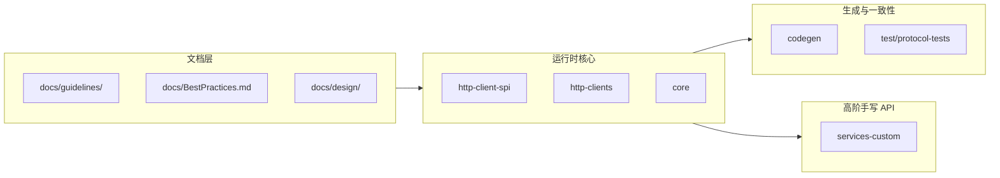

# 学习地图与学习路线

> **怎么用这张图**：每个阶段 = 少量阅读 + 1 个仓库内「锚点」+ 1 个自检问题。不要按字母顺序扫 `services/`。

---

## 一、总览地图（模块 → 你该学什么）

| 区域 | 优先读 | 学到什么 |
|------|--------|----------|
| `docs/guidelines/` | General、ClientConfiguration、Async | 团队 API 风格：Builder、不可变配置、异步约定 |
| `docs/BestPractices.md` | 全文 | 生产用法：超时、重试、凭证、客户端生命周期 |
| `http-client-spi` + `http-clients` | 接口 → 任一实现 | **SPI / 插件化**：核心与 HTTP 实现解耦 |
| `core` | 从公开 Client 入口往管线追 | 拦截器链、执行管线、同步/异步分叉 |
| `codegen` + `test/protocol-tests` | 生成入口 + 协议测试 | 规模化一致 API + 回归策略 |
| `services-custom` | DynamoDB Enhanced 等 | 在生成代码之上做「更好用」的一层 |
| 多数 `services/*` | **测试类**优于源码全文 | 生成代码很长；测试更短、更贴近用法 |

---

## 二、分阶段路线（推荐 4～6 周，可按周折叠）

### 阶段 A — 规范与用法（1 周）

| 天 | 阅读 | 仓库锚点（搜索或打开） | 验收问题（能口头答出即可） |
|----|------|------------------------|----------------------------|
| 1–2 | `docs/guidelines/aws-sdk-java-v2-general.md` | `UseOfOptional.md`、`FavorStaticFactoryMethods.md` | 为什么更倾向静态工厂而不是 public 构造器？ |
| 3–4 | `docs/BestPractices.md` | 任选常用服务的 `*Test.java` | 客户端应该每次 new 还是复用？为什么？ |
| 5 | `docs/guidelines/ClientConfiguration.md` | 任意 `*Configuration` 或 Builder 类 | Builder 里 List/Map 通常要如何防御性拷贝？ |

**阶段 A 完成标准**：能画出「应用代码 → Client → HTTP → AWS」的一层一层方块图（不必精确类名）。

---

### 阶段 B — HTTP 与 SPI（1～2 周）

| 天 | 阅读 | 仓库锚点 | 验收问题 |
|----|------|----------|----------|
| 1–3 | `docs/guidelines/async-programming-guidelines.md`（前半） | `http-client-spi` 中核心接口 | SPI 与具体实现各解决什么问题？ |
| 4–7 | 同上（CompletableFuture 部分） | `http-clients` 中一个同步 + 一个异步实现对比 | 异步路径上哪些对象必须线程安全？ |

**阶段 B 完成标准**：能说明「换 HTTP 实现」需要动哪几层、哪层**不该**动。

---

### 阶段 C — 核心管线（2 周）

| 周 | 做法 | 验收问题 |
|----|------|----------|
| 1 | IDE 从某个 `*Client` 的 `operation` 方法往里 Step Into / Call Hierarchy | 拦截器大致插在什么位置？ |
| 2 | 对照 `docs/guidelines/logging-guidelines.md` 找日志点 | 为何要避免「又打日志又抛同一错误」的重复？ |

**阶段 C 完成标准**：能用自己的话描述一次 API 调用从「方法入口」到「发出 HTTP」的关键步骤（5～8 步即可）。

---

### 阶段 D — 生成与测试（1～2 周）

| 阅读 | 仓库锚点 | 验收问题 |
|------|----------|----------|
| `docs/guidelines/code-generation-guidelines.md` | `codegen/` 中 generator 包 | 生成代码如何保证风格一致？ |
| `docs/guidelines/testing-guidelines.md` | `test/protocol-tests` 目录结构 | 协议测试主要防什么类回归？ |

**阶段 D 完成标准**：能解释「为什么服务模块多但表面 API 仍像一家人」。

---

### 阶段 E — 高阶库与设计（持续）

| 阅读 | 仓库锚点 | 验收问题 |
|------|----------|----------|
| `docs/design/README.md` 里 **Released** 条目 | 对应 `docs/design/.../README.md` | 该特性解决的用户痛点用一句话怎么说？ |
| DynamoDB Enhanced 相关设计 | `services-custom` 下 dynamodb-enhanced | 增强客户端与「底层生成客户端」边界在哪？ |

---

## 三、与 `learning/examples` 的对照

| 阶段 | 建议跑的范例类 | 目的 |
|------|----------------|------|
| A | `BuilderAndImmutableConfigDemo` | 体会 Builder + 防御性拷贝 |
| B | `HttpClientSpiDemo` | 迷你 SPI：同一「客户端」换两种 fake 实现 |
| C | `AsyncPipelineMiniDemo` | CompletableFuture 组合与「别阻塞事件线程」 |
| D | （仓库内读 codegen） | 范例侧重 A–C；D 以阅读为主 |
| E | （读 design 文档） | 同上 |

---

## 四、反模式（省时间）

- 从 `services/s3/src/main/java/...` 逐行通读生成源码：信息密度低，易疲劳。
- 未建立阶段 A/B 就直接深啃 `core` 内部包：缺少「地图」容易迷失。
- 忽略 `docs/guidelines/`：你会错过团队认为最重要的「隐性规范」。
